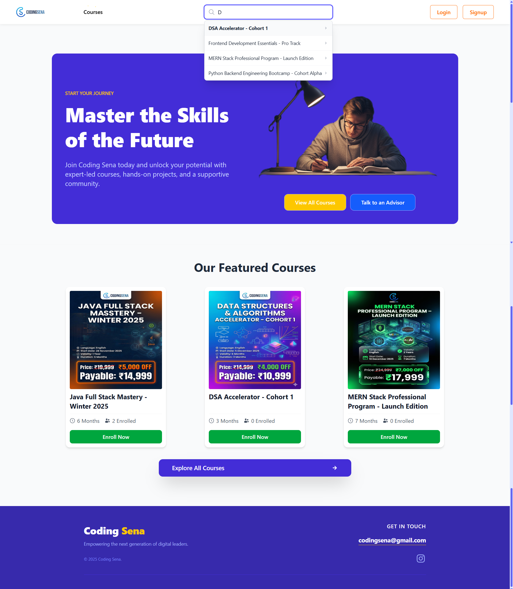
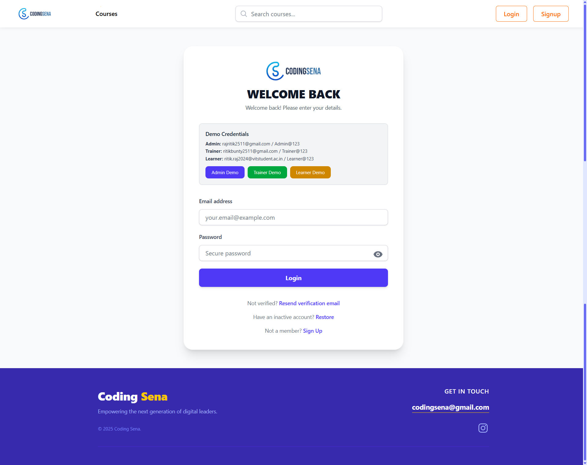
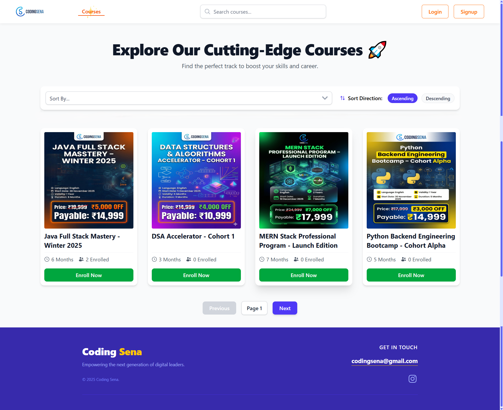
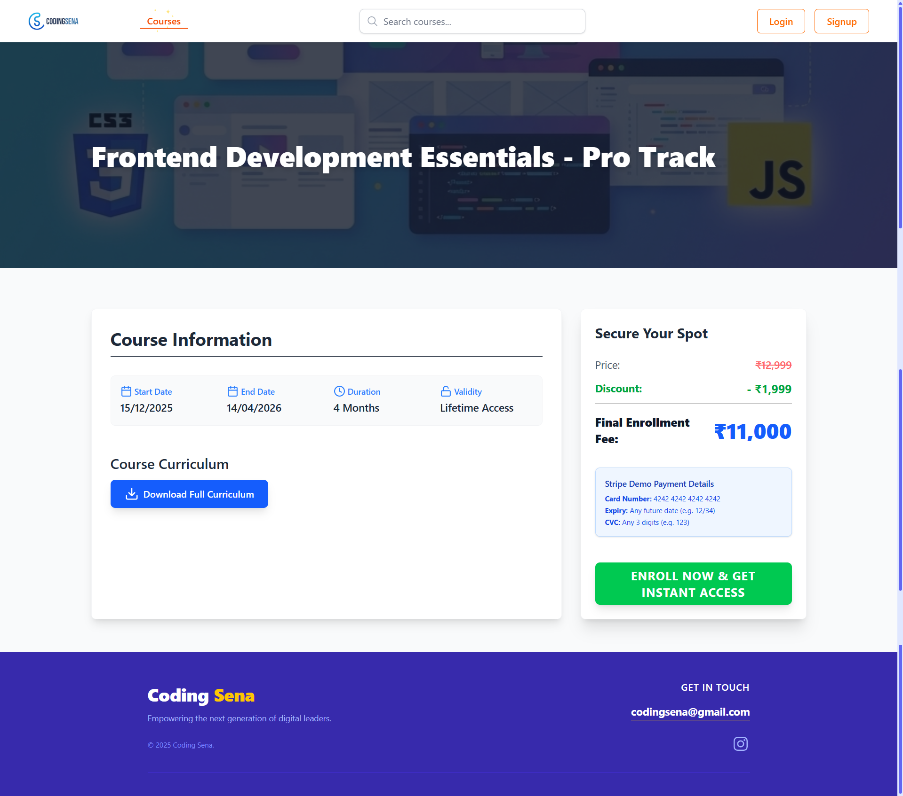
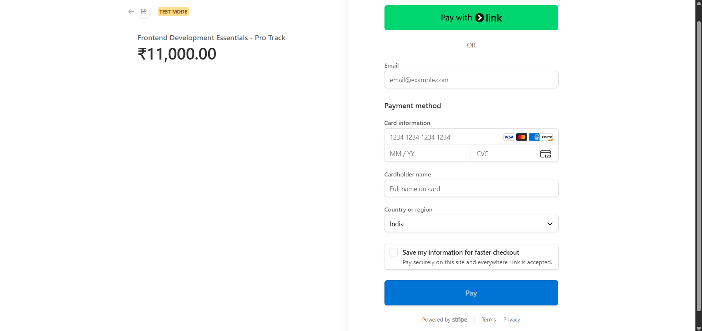
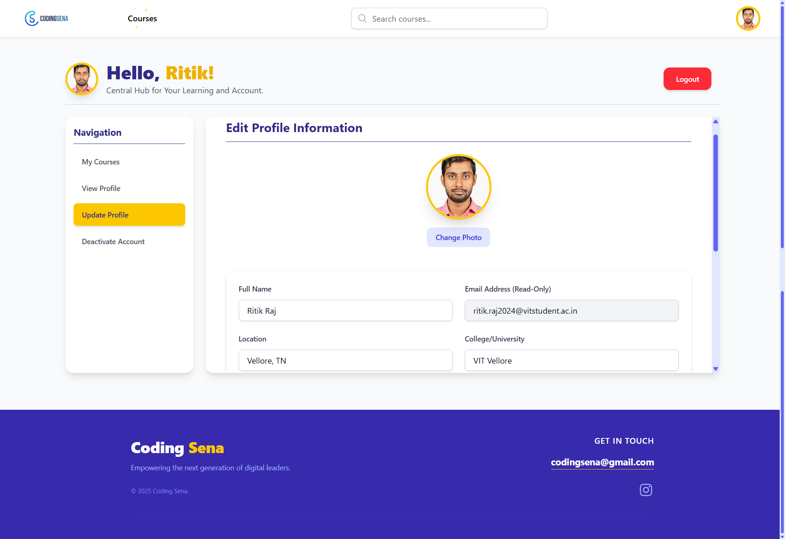
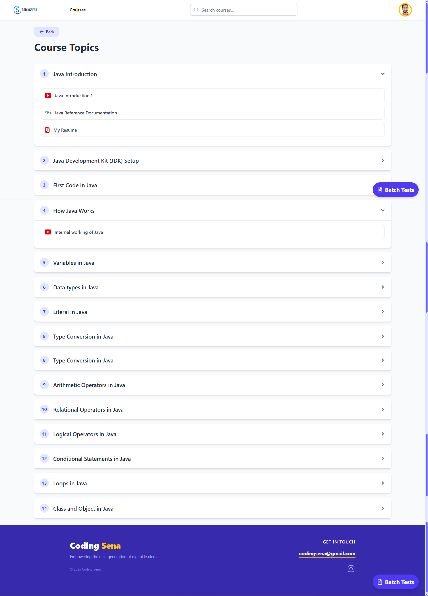
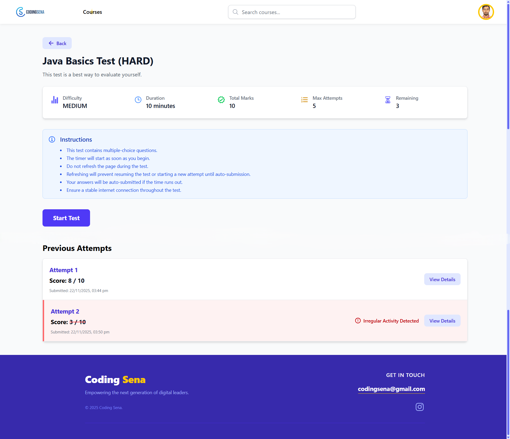
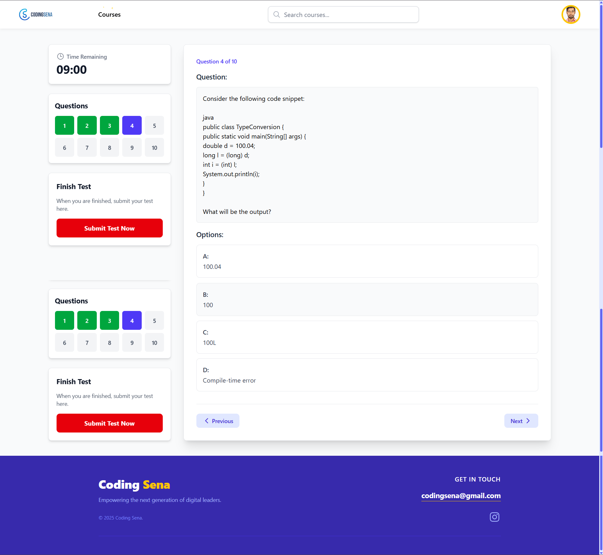

# 🎨 Coding Sena — Frontend  


### AI-Powered Learning Platform UI

Modern, scalable, and fully responsive frontend powering Coding Sena. Includes dashboards for **Admin**, **Trainer**, and **Learner**, AI-driven test experience, and optimized UX using React Query + Redux Persist.

---

# 📸 Screenshots

### 1. Home Page


### 2. Login Page


### 3. Courses Listing Page


### 4. Course Details Page


### 5. Enrollment/Payment Page (Stripe)


### 6. Learner Dashboard


### 7. Topics and Study Materials Page


### 8. Test Details Page


### 9. MCQ Test Taking


### 10. AI Recommendation UI


```
Note: Please explore website [here](https://codingsena.tech/) for more features (Trainer/Admin dashboards, etc.) and hands-on experience.
```
---

# 🚀 Tech Stack

- React 19  
- Vite  
- Tailwind CSS  
- React Router v7  
- React Query  
- Redux + Redux Persist  
- Axios  
- React Hook Form  
- React Markdown  
- React Toastify  

---

# ✨ Core Features

### 🧑‍🎓 Learner
- Enroll in batches  
- Access videos (YouTube embed)  
- Access PDFs  
- Attempt MCQs (timed)  
- Get AI recommendations  

### 🧑‍🏫 Trainer
- Create & manage topics  
- Upload videos & PDFs  
- Generate MCQs with AI  
- Export test reports  

### 👑 Admin
- Create/Manage batches  
- Assign trainers  
- Manage platform hierarchy  

### 📦 System Features
- Session persistence  
- Auto-refetch with React Query  
- Fully responsive  
- Clean UI  

---

# 🗂 Folder Structure

```
src/
 ├── assets/
 ├── codingsena/
 ├── components/
 ├── pages/
 ├── store/
 ├── App.jsx
 └── main.jsx
```

---

# 🛠 Setup Instructions

### Clone
```bash
git clone https://github.com/ritik-raj-25/coding-sena-frontend
cd coding-sena-frontend
```

### Install
```bash
npm install
```

### Run
```bash
npm run dev
```

---

# 🔐 Environment Variables (`.env.example`)

```
VITE_BACKEND_URL=http://localhost:8080
```

---

# 🌐 Deployment

Frontend URL: https://codingsena.tech/  
Backend URL: https://coding-sena-backend.onrender.com

Build:
```bash
npm run build
```

Deploy on:
- Netlify  

---

# 📝 License
MIT License
